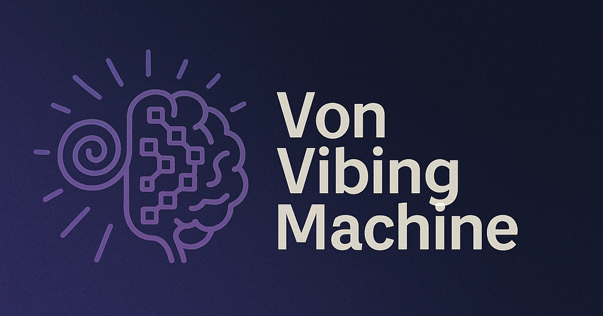

# VonVibingMachine: The Book

This project is a work of emergent fiction, in the spirit of Douglas Hofstadter, John Conway, John Von Neumann, Marvin Minsky, and Andrej Karpathy. 

A directory was initialized with a [55 line genesis README](genesis.md), claude-4-sonnet, and the instruction "Write dialogue-001." 

After each dialogue was written, the LLM context was wiped, and the prompt "write the next dialogue" was provided, along with read access to the prior dialogues. Starting at the 26th dialogue, the prompt was revised: "write the next dialogue. remember, the book ends after 30 dialogues." The computational costs for writing this book were covered within one month of Cursor's $20 subscription.

The website and agent definitions were built after the fact. 